# System Architecture Flow Chart

## Complete System Overview

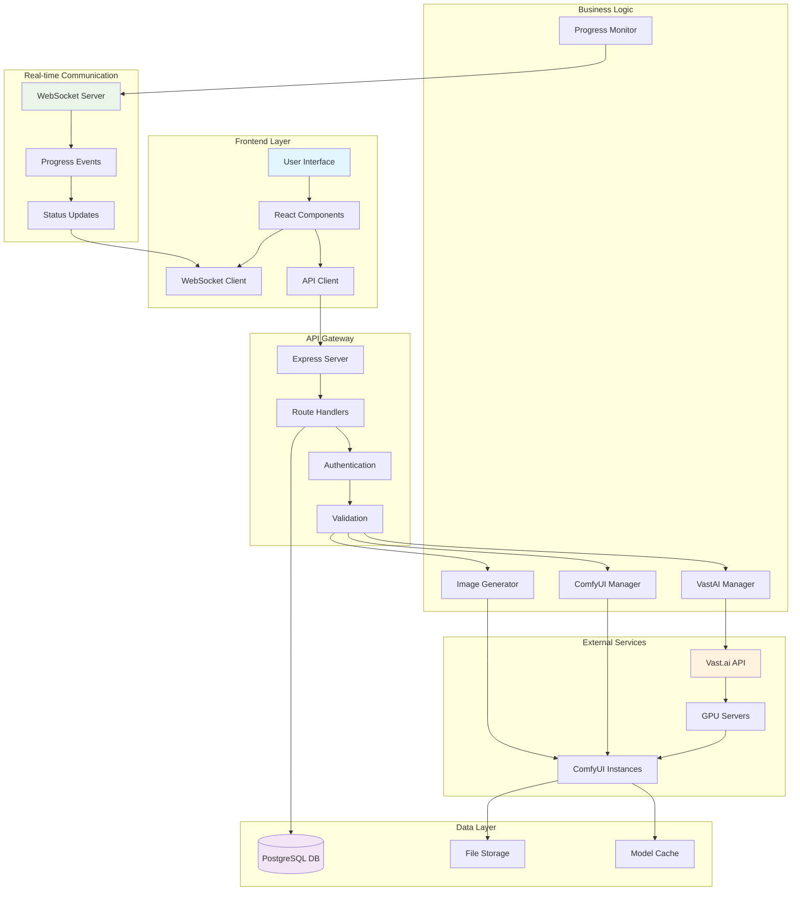

## Detailed Component Interaction Flow

### 1. Server Creation and Setup Process

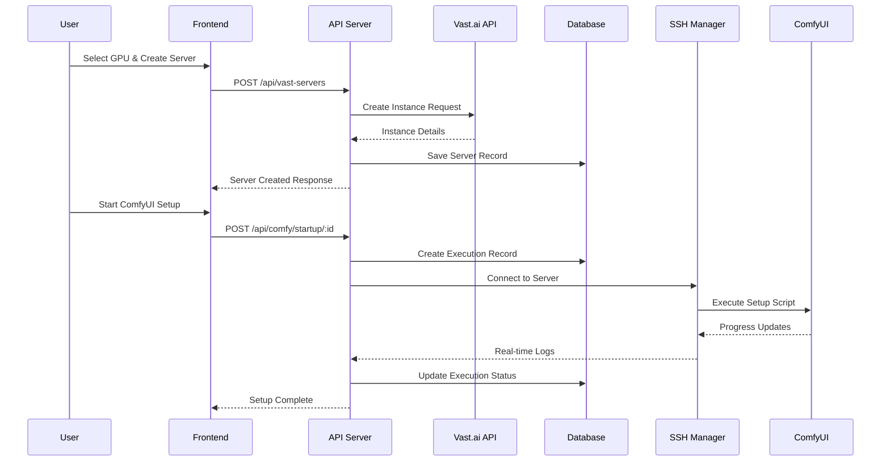

### 2. Image Generation Workflow

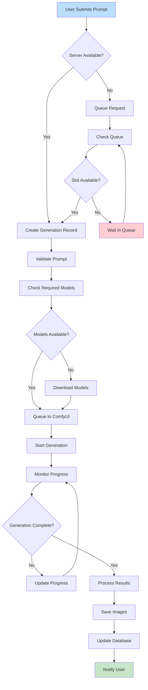

### 3. Real-time Progress Monitoring

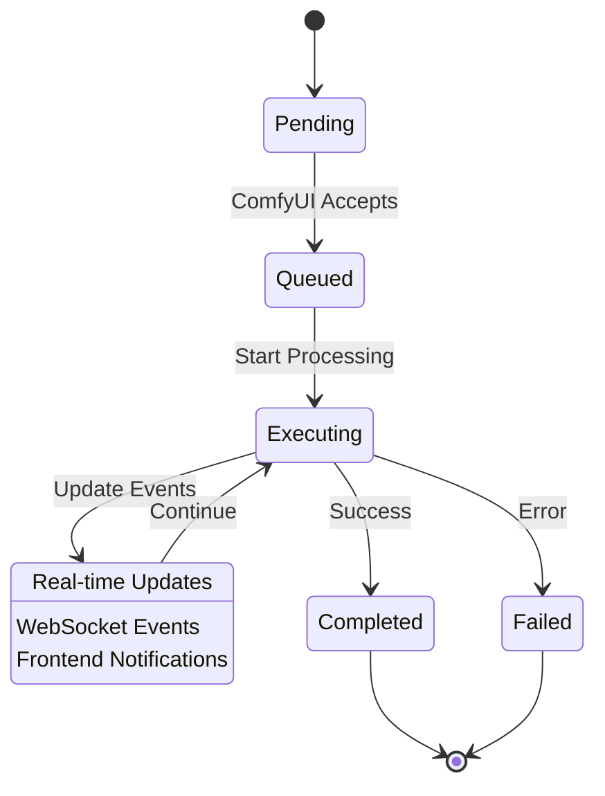

## Data Flow Architecture

### 1. Database Entity Relationships

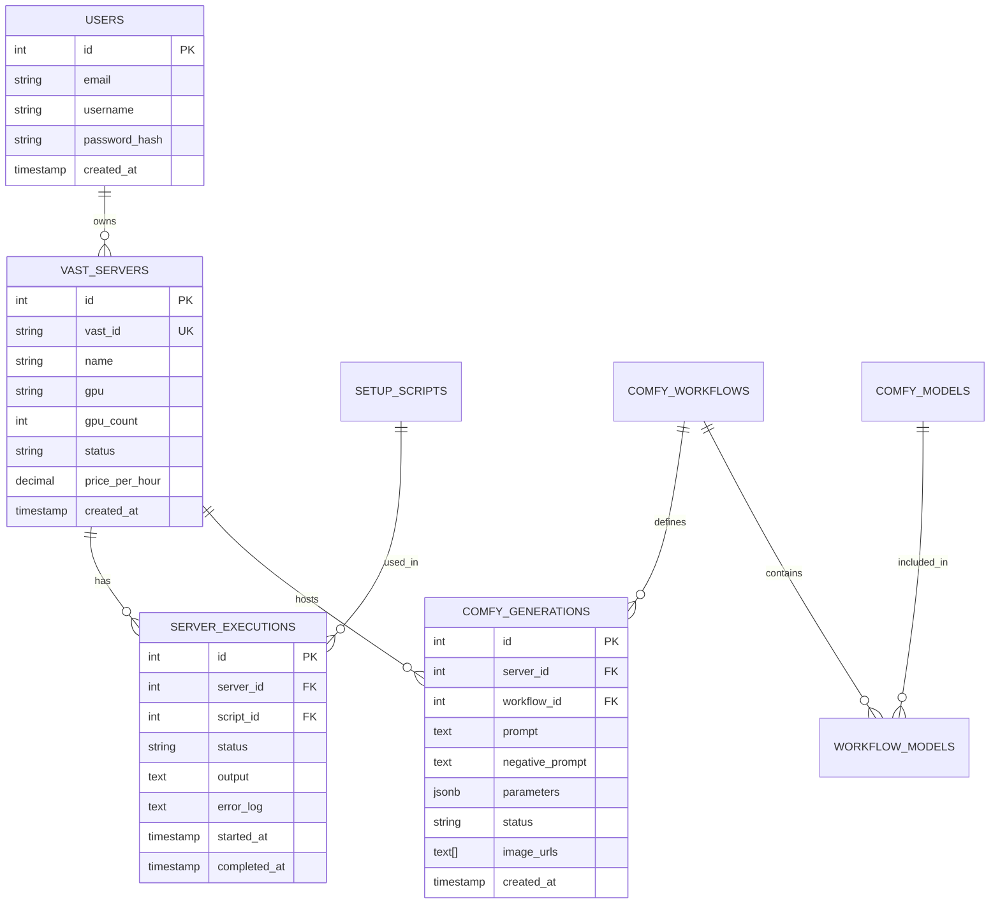

### 2. API Request/Response Flow

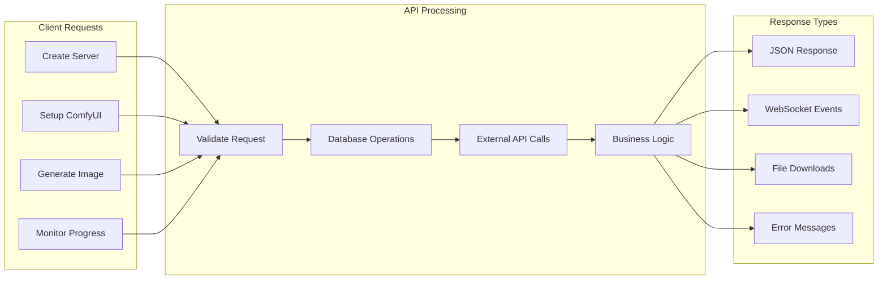

## WebSocket Communication Pattern

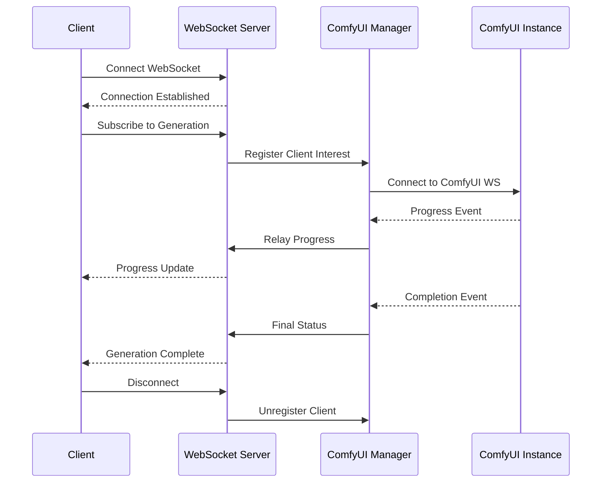

## Error Handling Flow

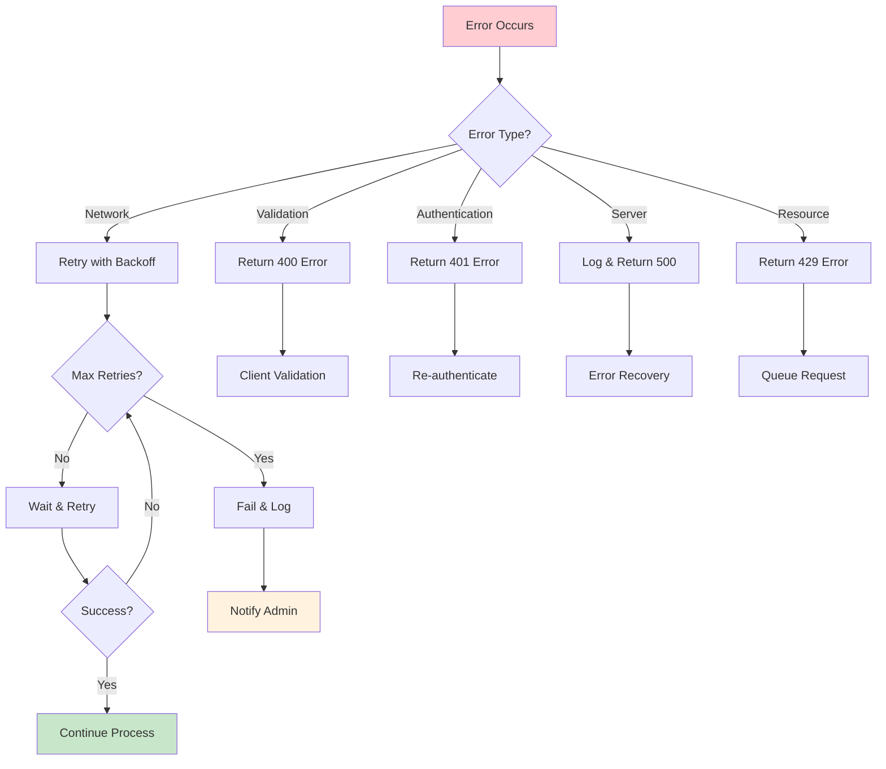

## Security and Authentication Flow

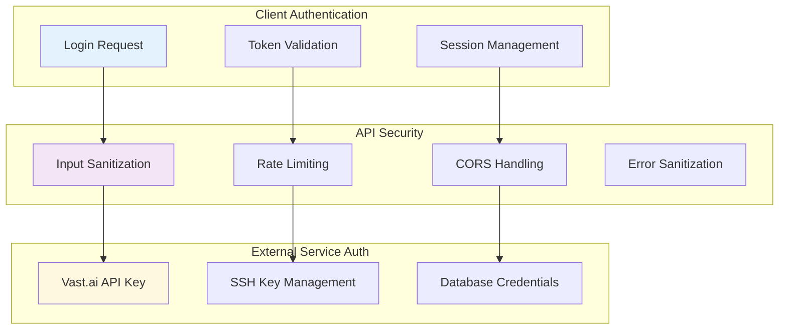

## Performance Optimization Strategy

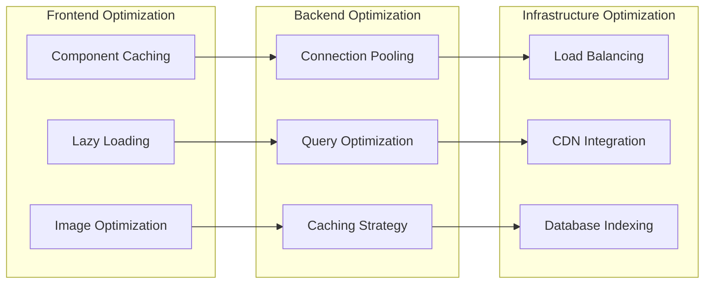

## Deployment Architecture

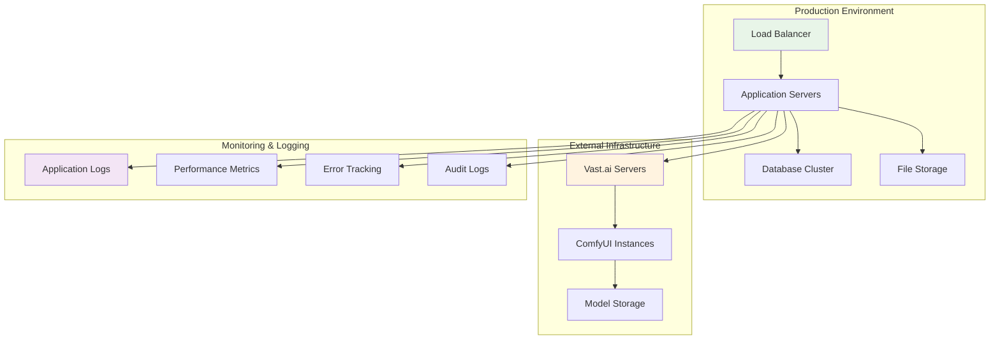

This comprehensive flow chart documentation provides a complete visual representation of the system architecture, showing how ComfyUI, Vast.ai, and image generation components interact within the larger application ecosystem.